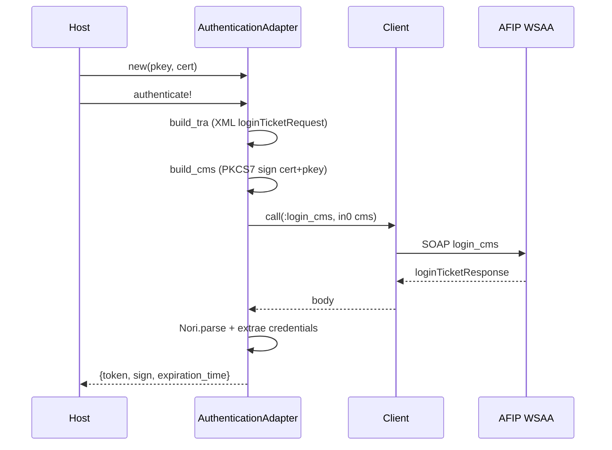
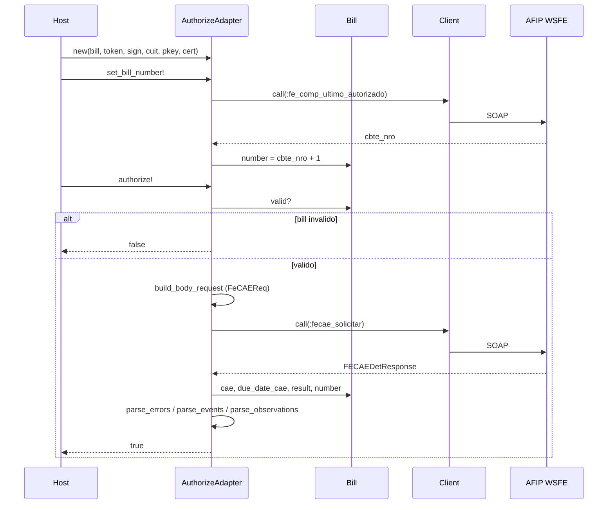

# Comportamiento — snoopy_afip
> meta: artefacto · RFC-007 · generado arch-enrich · anclado a 7813cf2 · cobertura: 3 flujos documentados / 0 pendientes localizados

## Cobertura

| flujo | estado |
|---|---|
| Autenticación WSAA (`authenticate!`) | documentado |
| Numeración del comprobante (`set_bill_number!`) | documentado |
| Autorización WSFE (`authorize!`) | documentado |
| Consulta de comprobante (`invoice_informed?`) | no documentado (variante de lectura de `fe_comp_consultar`) |

## 1. Resumen

Dos flujos de negocio encadenados: autenticación (WSAA, una vez por 12h) y autorización (WSFE, por comprobante). El segundo asume credenciales ya obtenidas. El diseño separa el parseo de la respuesta WSFE en capas que no se tumban entre sí.

## 2. Flujos

### Autenticación WSAA — `authenticate!`

Contexto: obtiene `token`/`sign` firmando un TRA con cert+pkey.

### Autorización WSFE — `set_bill_number!` + `authorize!`

Contexto: numera y autoriza un `Bill` válido; setea CAE y parsea errores/eventos/observaciones en capas independientes.

## 3. Inferencias

| ítem | confidence | a verificar |
|---|---|---|
| `set_bill_number!` se llama antes de `authorize!` | inferred | el README los muestra en ese orden; confirmar si `authorize!` exige número previo |
| El parseo en capas no propaga (acumula en `errors`/`afip_*`) | declared | diseño "No Explota" del README; confirmado en código |

## 4. Cobertura y fronteras

- `invoice_informed?` (lectura `fe_comp_consultar`) no diagramado — acreta en próximo PR que lo toque.
- La firma CMS/OpenSSL detallada (PKCS7) no se desglosa; ver `build_cms`.
- Comportamiento de fallo (timeout/degradación) → `docs/consumed/afip.md §e`.
