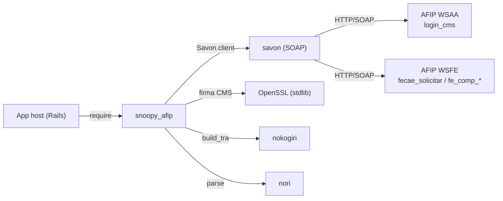

# Topología — snoopy_afip
> meta: artefacto · RFC-006 · generado arch-structure · anclado a 7813cf2 · cobertura: deps de runtime + servicios externos AFIP

## 1. Resumen

Gema cliente SOAP. Una sola dependencia de runtime declarada en el `.gemspec` (`savon`), que arrastra el stack SOAP (httpi, nori, gyoku, akami, wasabi, nokogiri). Consume dos servicios SOAP externos de AFIP: WSAA (auth) y WSFE (facturación). No corre como proceso propio: se embebe en el host (típicamente una app Rails).

## 2. Dependencias

| nombre | versión | rol |
|---|---|---|
| `savon` | `~> 2.17` (gemspec) · `2.17.3` (lock) | cliente SOAP — única dep de runtime declarada |
| `httpi` | `4.0.4` (lock, transitiva) | capa HTTP de savon (sobre `faraday`) |
| `faraday` | `2.14.3` (lock, transitiva) | backend HTTP de httpi 4 |
| `nori` | `2.7.x` (lock, transitiva) | XML→Hash (usado directo en `AuthenticationAdapter`) |
| `nokogiri` | `1.19.4` (lock, transitiva) | parser XML; usado directo en `build_tra` (`Nokogiri::XML::Builder`) |
| `nkf` | `0.3.0` (lock, transitiva) | encoding en httpi 4 (reemplazo del `kconv` removido de stdlib) |
| `gyoku` `akami` `wasabi` `builder` | ver lock | transitivas de savon |
| `OpenSSL` (stdlib) | — | firma CMS/PKCS7, generación de clave/CSR |
| `Timeout` (stdlib) | — | corta llamadas SOAP (`Snoopy::Client#call`) |

## 3. Grafo

## 4. Modos de ejecución

| modo | aplica | nota |
|---|---|---|
| librería embebida | sí | se usa dentro del proceso del host; sin daemon/worker propio |
| web / worker / cron propios | no | la gema no define procesos |

## 5. Cobertura y fronteras

- **`Gemfile.lock` regenerado** con el stack httpi 4 (savon 2.17). **Requiere Ruby ≥ 3.0** (savon 2.15+/httpi 4/wasabi 5 exigen 3.0). El lock se resuelve para Ruby 3.x.
- Servicios AFIP externos (WSAA/WSFE): contrato consumido en `docs/consumed/` (RFC-018).
- Topología upstream de AFIP (infra del organismo) fuera de alcance.
